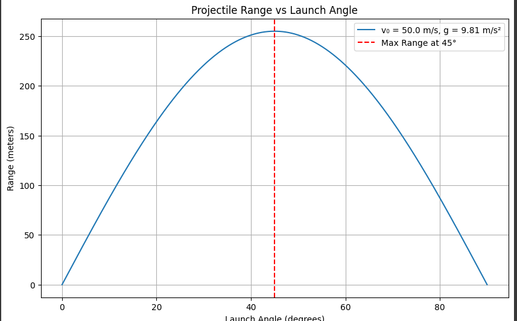
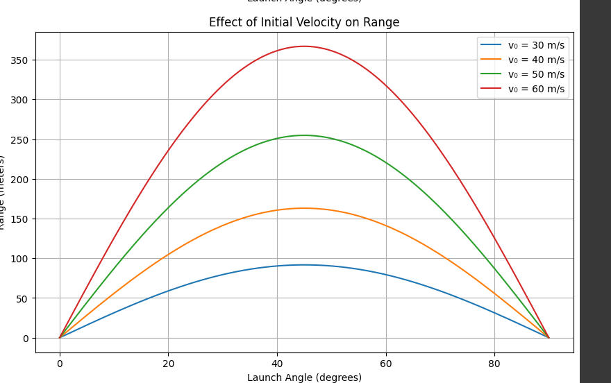
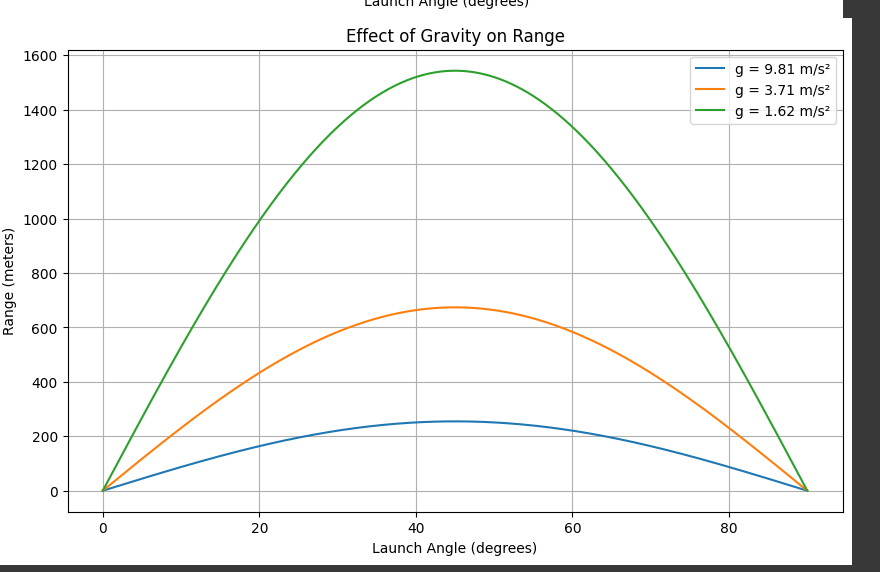

# Projeksiyon açısının bir fonksiyonu olarak aralığın araştırılması
 
## 1. Teorik Temeller
 
### Yönetim Denklemlerinin Türetilmesi
 
Bir merminin hareketi, Newton'un ikinci yasası uygulanarak tanımlanabilir. Yataya göre $\theta$ açısında $v_0$ hızla bir başlangıç konumundan fırlatılan bir mermi için elimizde:
 
Yatay yönde (x ekseni):
$$\frac{d^2x}{dt^2} = 0$$
 
Dikey yönde (y ekseni):
$$\frac{d^2y}{dt^2} = -g$$
 
Burada $g$ yerçekimi ivmesidir (Dünya'da yaklaşık 9.81 m/s²).
 
Bu denklemleri zamana göre başlangıç koşullarıyla bütünleştirirsek:
- $x(0) = 0$
- $y(0) = H$ (başlangıç yüksekliği)
- $v_x(0) = v_0\cos(\theta)$
- $v_y(0) = v_0\sin(\theta)$
 
Elde ettiklerimiz:
 
$$x(t) = (v_0\cos\theta)t$$
$$y(t) = h + (v_0\sin\theta)t - \frac{1}{2}gt^2$$
 
Bu parametrik denklemler, merminin herhangi bir zamanda $t konumunu tanımlar.
 
### Çözüm Ailesi
 
Çözüm ailesi, parametrelerin değiştirilmesiyle tanımlanır:
- İlk hız ($v_0$)
- Fırlatma açısı ($\theta$)
- Başlangıç yüksekliği ($h $)
- Yerçekimi ivmesi ($g$)
 
Bu parametrelerin her kombinasyonu benzersiz bir yörünge oluşturur.
 
## 2. Aralık Analizi
 
### Aralık Denklemi
 
$R$ aralığı, mermi ilk yüksekliğine döndüğünde kat edilen yatay mesafedir. Bunu bulmak için, $y(t) = h$ olduğunu belirlememiz gerekir:
 
$$h + (v_0\sin\theta)t - \frac{1}{2}gt^2 = h$$
 
Basit -leştirme:
$$(v_0\sin\theta)t - \frac{1}{2}gt^2 = 0$$
 
Bu denklemin iki çözümü vardır: $t = 0$ ve $t = \frac{2v_0\sin\theta}{g}$
 
İkinci çözüm bize uçuş süresini verir. Aralık o zaman:
 
$$R = (v_0\cos\theta) \cdot \frac{2v_0\sin\theta}{g} = \frac{v_0^2\sin(2\theta)}{g}$$
 
Bu, aralığın aşağıdakilerle orantılı olduğunu gösterir:
- İlk hızın karesi
- Projeksiyon açısının iki katı sinüs
- Yerçekimi ivmesi ile ters orantılı
 
### Maksimum Menzil için Optimum Açı
 
Aralığı en üst düzeye çıkaran açıyı bulmak için, $\theta$'ye göre farklılaştırırız ve sıfıra eşit olarak ayarlarız:
 
$$\frac{dR}{d\theta} = \frac{v_0^2\cos(2\theta)}{g} = 0$$
 
Bu bize $\cos(2\theta) = 0$ verir, dolayısıyla $2\theta = \frac{\pi}{2}$ veya $\theta = \frac{\pi}{4} = 45°$
 
Bu nedenle, hava direncinin yokluğunda ve düz bir iniş yüzeyi ile, maksimum menzil 45°'lik bir açıyla elde edilir.
 
### Başlangıç Yüksekliğinin Etkisi
 
Mermi, iniş yüzeyinin $h $ üzerindeki bir yükseklikten fırlatılırsa, menzil denklemi daha karmaşık hale gelir:
 
$$R = v_0\cos\theta \cdot t_{iniş}$$
 
Burada $t_{iniş}$, merminin yer seviyesine ulaştığı zamandır ($y = 0$):
 
$$h + (v_0\sin\theta)t_{iniş} - \frac{1}{2}gt_{iniş}^2 = 0$$
 
Bu ikinci dereceden denklemi çözmek:
 
$$t_{iniş} = \frac{v_0\sin\teta + \sqrt{(v_0\sin\theta)^2 + 2gh}}{g}$$
 
Bu, aralığın artık başlangıç yüksekliğine de bağlı olduğu anlamına gelir:
 
$$R = v_0\cos\theta \cdot \frac{v_0\sin\theta + \sqrt{(v_0\sin\theta)^2 + 2gh}}{g}$$
 
## 3. Pratik Uygulamalar
 
### Gerçek Dünyada Dikkat Edilmesi Gerekenler
 
Uygulamada, mermi hareketi şunlardan etkilenir:
- Hava direnci (sürükleme)
-Rüzgar
- Değişen yerçekimi alanı
- Dönen referans çerçeveleri (Coriolis etkisi)
- Düzgün olmayan arazi
 
### Hava Direncinin Dahil Edilmesi
 
Hava direnci için basit bir model, hız ile orantılı bir sürükleme kuvveti içermektir:
 
$$F_d = -bv$$
 
Bu, değiştirilmiş bir diferansiyel denklem kümesine yol açar:
 
$$\frac{d^2x}{dt^2} = -\frac{b}{m}v_x$$
$$\frac{d^2y}{dt^2} = -g - \frac{b}{m}v_y$$
 
Burada $b$ sürükleme katsayısı ve $m$ merminin kütlesidir.
 
Bu denklemler tipik olarak çözmek için sayısal yöntemler gerektirir.
 
## 4.  pyhton uygulaması
! 
 
 