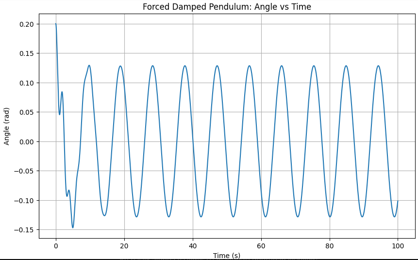
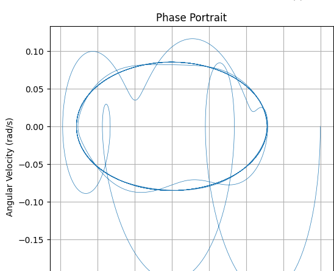

# Investigating the Dynamics of a Forced Damped Pendulum

## 1. Theoretical Foundation

### Governing Equation

The motion of a forced damped pendulum is governed by the nonlinear second-order differential equation:

$$
\frac{d^2\theta}{dt^2} + b\frac{d\theta}{dt} + \frac{g}{L} \sin\theta = A \cos(\omega t)
$$

Where:

- \( \theta(t) \): angular displacement  
- \( b \): damping coefficient  
- \( g \): gravitational acceleration  
- \( L \): length of the pendulum  
- \( A \): amplitude of the driving force  
- \( \omega \): driving force frequency  

### Small-Angle Approximation

For small angles \( \theta \ll 1 \), we approximate \( \sin\theta \approx \theta \), which simplifies the equation to:

$$
\frac{d^2\theta}{dt^2} + b\frac{d\theta}{dt} + \frac{g}{L} \theta = A \cos(\omega t)
$$

This is a linear non-homogeneous differential equation, analogous to a driven harmonic oscillator.

---

## 2. Analysis of Dynamics

### Parameter Effects

- **Damping coefficient (b):** Controls how quickly oscillations decay.  
- **Driving amplitude (A):** Governs energy input into the system.  
- **Driving frequency (ω):** Affects resonance and can lead to complex or chaotic motion.

### Chaos and Regularity

As parameters vary, the system may transition from regular periodic behavior to chaotic dynamics. These transitions are observable in phase portraits and Poincaré sections.

---

## 3. Practical Applications

- **Energy Harvesting Devices:** Utilizing resonance to convert vibrations into electrical energy.  
- **Suspension Bridges:** Oscillations under wind or pedestrian traffic resemble driven pendulum behavior.  
- **RLC Circuits:** The electrical analog of the mechanical forced damped oscillator.  
- **Biomechanics:** Human leg motion during walking or running mimics pendulum dynamics with periodic forcing.

---

## 4. Simulation and Visualization

Using Python:

- We solve the nonlinear differential equation numerically.  
- We visualize the results using:
  - **Angle vs. Time** plot  
  - **Phase Portrait** (Angle vs. Angular Velocity)  
  - **Poincaré Section** (discrete sampling each driving cycle)

---

## 5. Limitations and Extensions

### Limitations

- Small-angle approximation is only valid for \( \theta \ll 1 \).  
- Real systems may include nonlinear damping.  
- External forcing can be non-periodic or noisy in real-world settings.

### Extensions

- Add nonlinear damping (e.g., quadratic or Coulomb).  
- Introduce stochastic or chaotic forcing.  
- Plot bifurcation diagrams to explore system behavior across parameter changes.
