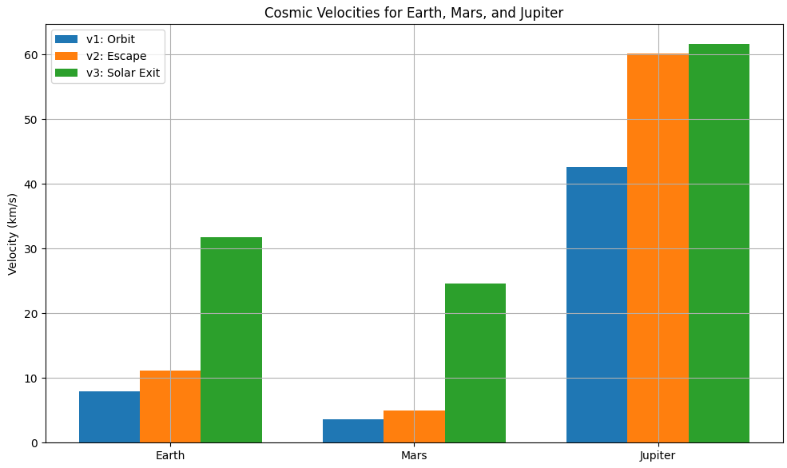

#  Escape Velocities and Cosmic Velocities

##  Motivation

Escape velocity determines how much energy a spacecraft needs to break free from the gravity of a planet or a star. The extended concept of cosmic velocities defines three thresholds that shape the trajectory of all space missions—whether they're orbiting Earth, flying to Mars, or aiming for the stars.

Understanding these thresholds is a cornerstone in mission design, launch dynamics, and fuel budgeting.

---

##  Definitions and Physical Meanings

###  First Cosmic Velocity ($v_1$)
The minimum speed needed for a stable **circular orbit** just above a celestial body's surface:

$$
v_1 = \sqrt{\frac{G M}{R}}
$$

- The object remains in free fall around the planet.
- Typical application: artificial satellites.

---

###  Second Cosmic Velocity ($v_2$)
The **escape velocity**, allowing an object to leave the gravitational field without further propulsion:

\[
$v_2 = \sqrt{2} \cdot v_1 = \sqrt{\frac{2 G M}{R}}$

- Object reaches "infinity" with zero residual speed.
- Used for Moon missions, planetary probes.

---

###  Third Cosmic Velocity ($v_3$)
The speed required to escape the **Sun's gravity** starting from a planet's orbit:

\[
$v_3 = \sqrt{v_2^2 + v_{\text{orb}}^2}$

- $v_{\text{orb}}$: orbital velocity of the planet around the Sun.
- Required for interstellar missions (e.g. Voyager).

---

##  Parameters Affecting Velocities

| Parameter | Effect |
|----------|--------|
| **Mass ($M$)** | Heavier planets → Higher velocities |
| **Radius ($R$)** | Smaller radius → Greater surface gravity |
| **Orbital speed ($v_{\text{orb}}$)** | Affects only $v_3$, not $v_1$ or $v_2$ |

---

