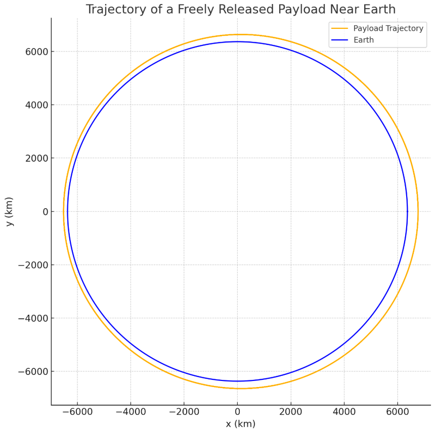

#  Trajectories of a Freely Released Payload Near Earth

##  Motivation

When a payload is released from a moving rocket or satellite near Earth, its path is dictated by the delicate balance of gravitational pull and the initial velocity vector. This motion is central to space operations such as orbital insertion, satellite deployment, and atmospheric reentry. Understanding these paths enables precise mission planning and execution.

---

##  Core Physical Principles

### Universal Gravitation

According to Newton’s Law:

\
$$
F = G \frac{M m}{r^2}
$$

\

Where:

- \( M \): Earth's mass  
- \( m \): payload mass  
- \( r \): distance from Earth's center  

---

### Gravitational Acceleration

The gravitational force results in an acceleration:

\[
$$
\vec{a} = -\frac{G M}{r^3} \vec{r}
$$

\]

This acceleration always points toward Earth’s center and governs the curvature of the path.

---

##  Trajectory Types Based on Energy

The total mechanical energy \( E \) of the payload is:

\[
$$
E = \frac{1}{2}mv^2 - \frac{G M m}{r}
$$

\]

This determines the type of trajectory:

- **Elliptical orbit** \( (E < 0) \): Bound, repeating path
- **Parabolic escape** \( (E = 0) \): Just enough energy to escape
- **Hyperbolic escape** \( (E > 0) \): Escapes with excess energy

---

### Escape Velocity

The threshold for unbound motion:

\[
$$
v_{\text{esc}} = \sqrt{\frac{2GM}{r}}
$$

\]

If a payload exceeds this, it is no longer gravitationally bound to Earth.

---

##  Simulation Strategy

We simulate the motion using **semi-implicit (symplectic) Euler integration** to better conserve energy in long-term simulations. This gives us better behavior in near-orbit paths compared to naive Euler.

---

