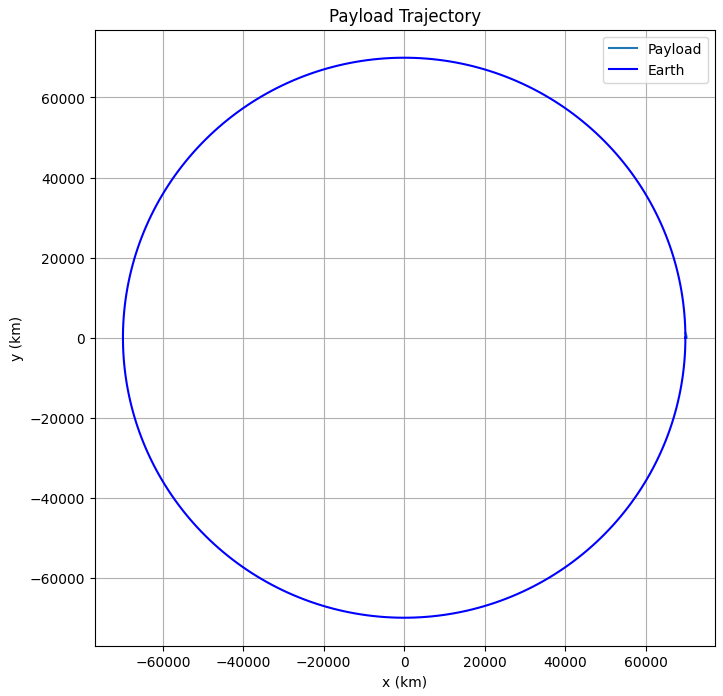

# Trajectories of a Freely Released Payload Near Earth

---

## Trajectory Classification

- *Suborbital*: Payload falls back.
- *Orbital*: Stays in closed elliptical path.
- *Escape*: Unbound trajectory if $v > v_{\text{esc}}$

---

These simulations, grounded in physical laws, help illustrate how gravity shapes motion in space and are indispensable for mission planning and orbital dynamics.