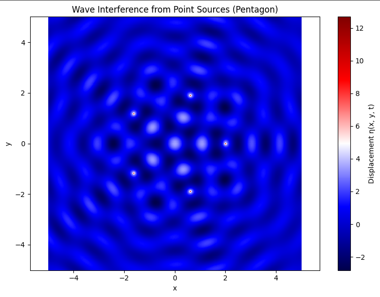

#  Interference Patterns on a Water Surface from Point Sources at Regular Polygon Vertices

---

##  Wave Equation for a Single Source

The water surface displacement from a single source at position $(x_0, y_0)$ is given by:

$$
\eta(x, y, t) = \frac{A}{\sqrt{r}} \cos(k r - \omega t + \phi)
$$

Where:

- $r = \sqrt{(x - x_0)^2 + (y - y_0)^2}$
- $k = \frac{2\pi}{\lambda}$
- $\omega = 2\pi f$

---

##  Step 1: Select a Regular Polygon

We choose a **regular pentagon** (5 sources) centered at the origin.

---

## Step 2–5: Superposition and Interference

The total displacement at point $(x, y)$ from all sources is:

$$
\eta_{\text{sum}}(x, y, t) = \sum_{i=1}^N \eta_i(x, y, t)
$$

Where $N = 5$ for the pentagon.

---

##  Step 6: Visualization

We visualize $\eta_{\text{sum}}(x, y, t)$ over a 2D grid at a fixed time to observe interference patterns.

---

