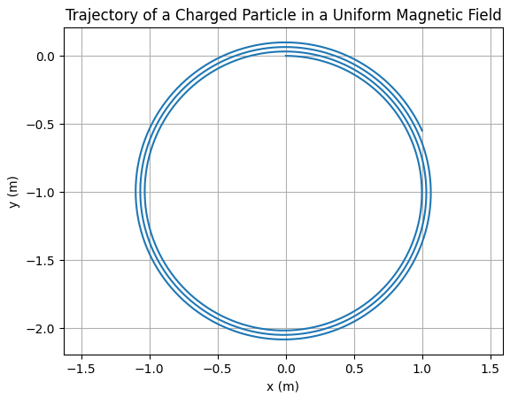

# Simulating the Effects of the Lorentz Force

## 1. Motivation

The Lorentz force governs the motion of charged particles in electric and magnetic fields. It is given by:

$$
\vec{F} = q\vec{E} + q\vec{v} \times \vec{B}
$$

This force plays a key role in systems such as:

- Particle accelerators
- Mass spectrometers
- Plasma confinement devices
- Cyclotrons and magnetic traps

---

## 2. Task Summary

We simulate and visualize the trajectory of a charged particle under:

- A uniform magnetic field
- Combined electric and magnetic fields
- Crossed electric and magnetic fields

We explore:

- Effects of varying field strengths ($\vec{E}$, $\vec{B}$)
- Initial velocity $\vec{v}$
- Charge $q$ and mass $m$

---

## 4. Observations

- The particle moves in a circular or helical path in a uniform magnetic field.
- Larmor radius $r_L = \frac{mv_\perp}{qB}$ depends on the perpendicular component of velocity.
- Adding an electric field causes drift and changes trajectory.

---

## 5. Suggestions for Extension

- Vary $\vec{E}$ and $\vec{B}$ for non-uniform fields.
- Implement 3D visualization using `matplotlib` or `plotly`.
- Add Runge-Kutta integration for higher accuracy.

---

## 6. Practical Relevance

- In **cyclotrons**, particles follow spiral paths under Lorentz force.
- In **mass spectrometers**, charge-to-mass ratio is calculated from curvature.
- In **plasma physics**, this governs confinement and drift dynamics.

