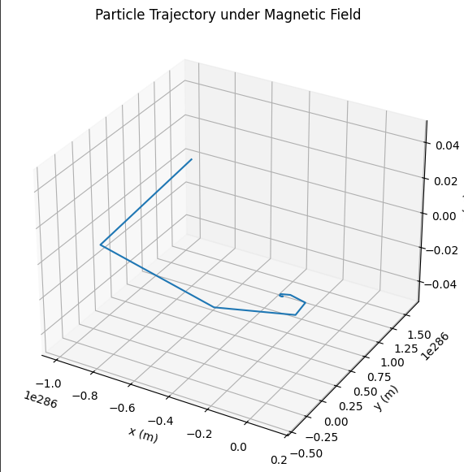

# Electromagnetism

##  Problem 1: Simulating the Effects of the Lorentz Force

---

###  Motivation:

The Lorentz force, expressed as:

$$ \mathbf{F} = q\mathbf{E} + q\mathbf{v} \times \mathbf{B} $$

governs the motion of charged particles in electric and magnetic fields. It is foundational in fields like **plasma physics**, **particle accelerators**, and **astrophysics**. By focusing on simulations, we can explore the practical applications and visualize the complex trajectories that arise due to this force.

---

###  Task:

#### 1. Exploration of Applications

- Identify systems where the Lorentz force plays a key role (e.g., particle accelerators, mass spectrometers, plasma confinement).
- Discuss the relevance of electric ($\mathbf{E}$) and magnetic ($\mathbf{B}$) fields in controlling the motion of charged particles.

#### 2. Simulating Particle Motion

Implement a simulation to compute and visualize the trajectory of a charged particle under:

- A uniform magnetic field.
- Combined uniform electric and magnetic fields.
- Crossed electric and magnetic fields.

Simulate the particle’s **circular**, **helical**, or **drift motion** based on initial conditions and field configurations.

#### 3. Parameter Exploration

Allow variations in:

- Field strengths ($\mathbf{E}, \mathbf{B}$)
- Initial particle velocity ($\mathbf{v}$)
- Charge and mass of the particle ($q, m$)

Observe how these parameters influence the trajectory.

#### 4. Visualization

- Create clear, labeled plots showing the particle’s path in 2D and 3D for different scenarios.
- Highlight physical phenomena such as the **Larmor radius** and **drift velocity**.

---

###  Deliverables

1. A Python script implementing the simulations.
2. Visualizations of particle trajectories for the specified field configurations.
3. A discussion on how the results relate to practical systems (e.g., cyclotrons, magnetic traps).
4. Suggestions for extending the simulation to more complex cases (e.g., non-uniform fields).

---

