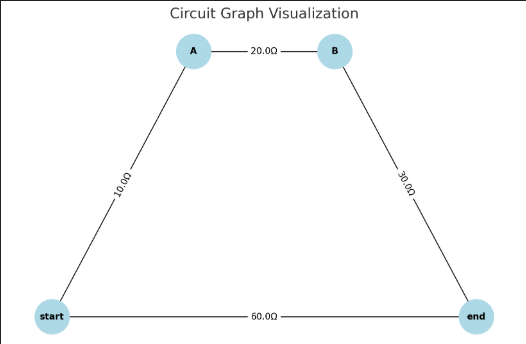

##  Algorithm Explanation

In the context of electrical circuits, calculating the equivalent resistance becomes increasingly complex when the circuit involves multiple resistors arranged in arbitrary configurations. Traditional approaches using series and parallel simplification rules can quickly become intractable. Instead, **graph theory** provides a structured and algorithmic alternative that is particularly suitable for automated analysis and simulation.

###  Graph Representation of Circuits

- Each **node** in the graph represents a **junction** or a connection point in the circuit.
- Each **edge** represents a **resistor**, where the **edge weight** corresponds to the resistance value in ohms ($\Omega$).
- The graph may contain **parallel edges** (multiple resistors between the same two nodes) or **nodes with degree 2** (candidates for series simplification).

This representation enables the use of graph traversal and simplification algorithms to reduce the circuit step by step.

---

###  Series Reduction

A **series connection** occurs when a node (say, $N$) connects exactly **two other nodes** (say, $A$ and $B$), and the node $N$ does **not** represent a special input/output node (e.g., `start` or `end`). In this case, resistors between $A$ and $N$ ($R_1$), and $N$ and $B$ ($R_2$) can be combined into a single resistor:

$$
R_{\text{eq}} = R_1 + R_2
$$

The simplification steps are:
1. Identify node $N$ with degree 2.
2. Remove $N$ and its connected edges.
3. Create a new edge between $A$ and $B$ with resistance $R_1 + R_2$.

This operation maintains the electrical equivalence of the circuit.

---

###  Parallel Reduction

A **parallel connection** is identified when **multiple resistors** connect the **same pair of nodes**. In this case, the equivalent resistance is given by:

$$
\frac{1}{R_{\text{eq}}} = \sum_{i=1}^{n} \frac{1}{R_i}
$$

Where $R_i$ is the resistance of the $i$-th edge between the two nodes. The steps for simplification are:
1. Identify all parallel edges between node pair $(A, B)$.
2. Calculate the reciprocal sum to find the equivalent resistance.
3. Remove all redundant edges and add a single edge with resistance $R_{\text{eq}}$.

This process preserves the total conductance between the two nodes.

---

###  Iterative Simplification Loop

Since circuits may have **nested** combinations of series and parallel resistors, the algorithm runs in an iterative loop:
1. Traverse all nodes to detect and simplify series configurations.
2. Traverse all node pairs to simplify parallel configurations.
3. Repeat the above steps until **no more simplifications** can be performed.

This loop guarantees that the circuit is reduced to its simplest form—a single resistor between the input and output terminals (e.g., start and end nodes).

---

###  Handling Nested Combinations

The power of this algorithm lies in its ability to handle **nested combinations** without explicitly recognizing the hierarchical structure. For example:

- A resistor in **series** with a set of resistors in **parallel** will automatically be handled as the series reduction algorithm continues to simplify linear chains.
- A **parallel** set of paths, each of which contains **series** connections internally, will be simplified from the inside out.

Because the simplification operations are **local and independent**, they naturally propagate through the graph as the structure is reduced.

---

