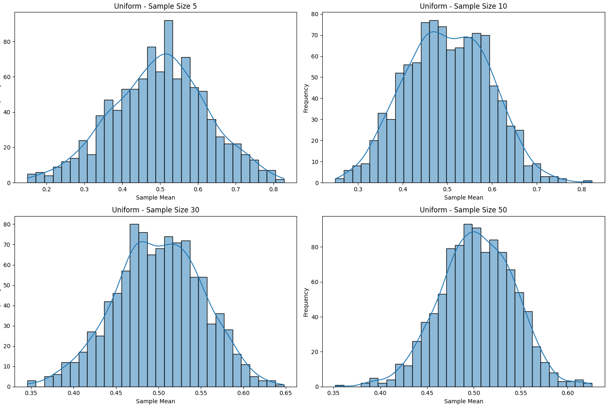
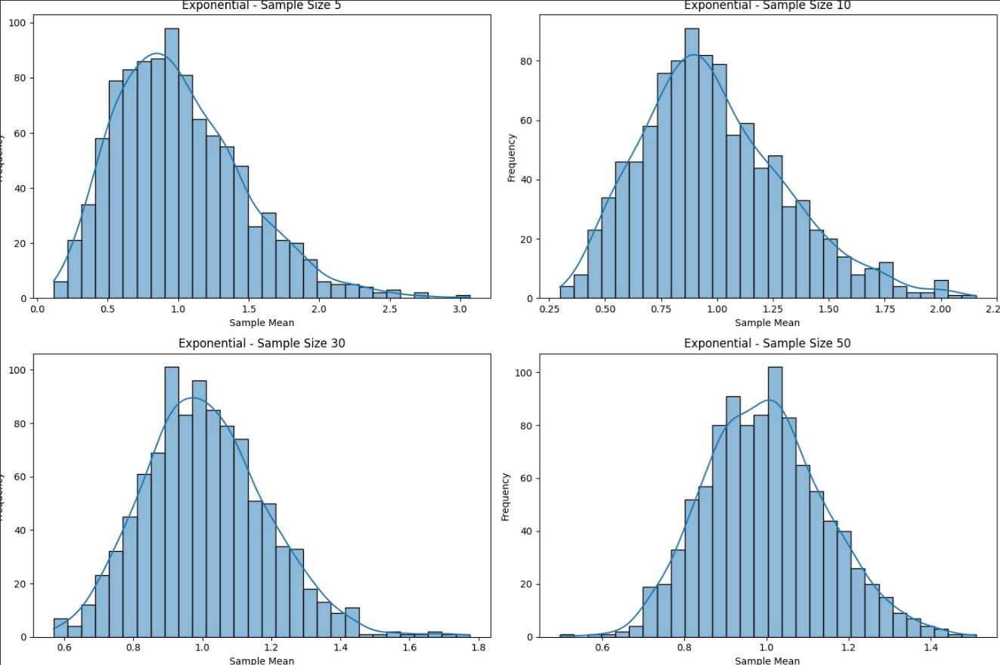
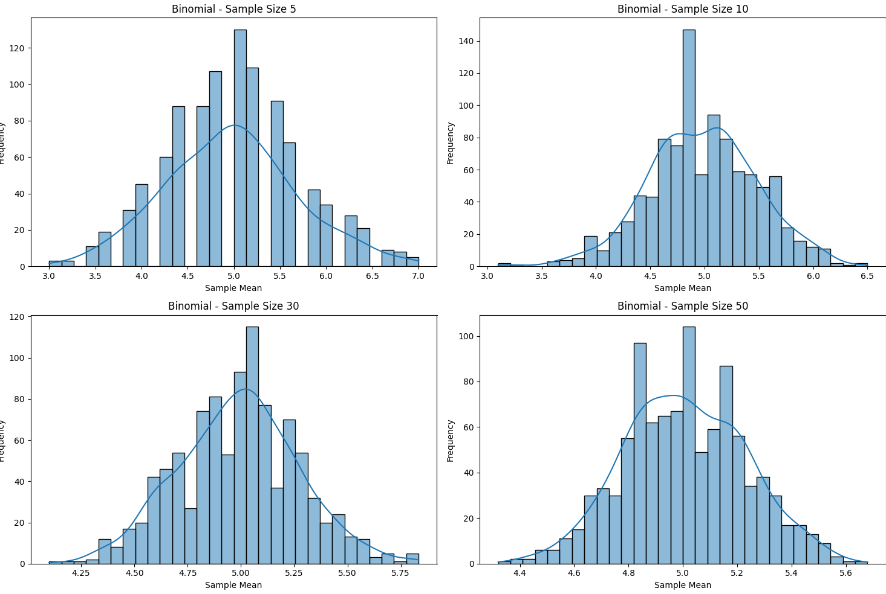

#  Comprehensive Statistical Simulation Report

##  Problem 1: Exploring the Central Limit Theorem (CLT) through Simulations

###  Motivation

The **Central Limit Theorem (CLT)** is a key concept in inferential statistics. It asserts that the distribution of the sample mean of a sufficiently large number of independent and identically distributed (i.i.d.) random variables tends toward a normal distribution, regardless of the shape of the original population distribution. This result is significant because it provides a theoretical justification for the widespread use of the normal distribution in hypothesis testing, confidence interval estimation, and control processes.

CLT has real-world significance in domains such as manufacturing, medicine, finance, and social sciences, where it facilitates predictive modeling and statistical inference even when the underlying population is unknown or skewed.

---

###  Objectives

- Simulate populations from multiple distributions (Uniform, Exponential, Binomial).
- Draw repeated samples of various sizes.
- Calculate sample means to build sampling distributions.
- Visualize the convergence of these sampling distributions to a normal distribution.
- Analyze how sample size and population variance influence convergence.

---

###  Population Distributions and Justification

1. **Uniform Distribution**: Represents complete randomness within bounds (e.g., sensor noise).
2. **Exponential Distribution**: Captures time-between-event data (e.g., radioactive decay).
3. **Binomial Distribution**: Models success/failure outcomes (e.g., clinical trial results).

Each simulated population consists of 100,000 values.

```python
import numpy as np
import matplotlib.pyplot as plt
import seaborn as sns

np.random.seed(0)
N = 100000
uniform_pop = np.random.uniform(0, 1, N)
exponential_pop = np.random.exponential(1, N)
binomial_pop = np.random.binomial(10, 0.5, N)
```

---

###  Sampling and Sample Mean Calculation

We generate 10,000 samples for each distribution at sizes $n = 5$, $10$, $30$, and $50$.

```python
def sample_means(pop, sample_sizes, num_samples):
    means = {}
    for n in sample_sizes:
        means[n] = [np.mean(np.random.choice(pop, size=n)) for _ in range(num_samples)]
    return means

sample_sizes = [5, 10, 30, 50]
uniform_means = sample_means(uniform_pop, sample_sizes, 10000)
exponential_means = sample_means(exponential_pop, sample_sizes, 10000)
binomial_means = sample_means(binomial_pop, sample_sizes, 10000)
```

---






###  Theoretical Basis

According to CLT:

$$
\bar{X} \sim \mathcal{N}\left(\mu, \frac{\sigma^2}{n}\right)
$$

Where:
- $\bar{X}$ is the sample mean
- $\mu$ is the population mean
- $\sigma^2$ is the population variance
- $n$ is the sample size

---

###  Discussion & Implications

- **Skewed distributions** like exponential require larger $n$ for the CLT to manifest clearly.
- **Spread** of the sampling distribution decreases with increasing $n$ (due to $1/\sqrt{n}$ scaling).
- Even with moderate sample sizes ($n = 30$), the CLT provides remarkably accurate approximations.

**Applications:**
- Polling
- Quality control
- Financial modeling
- Clinical trials

---


