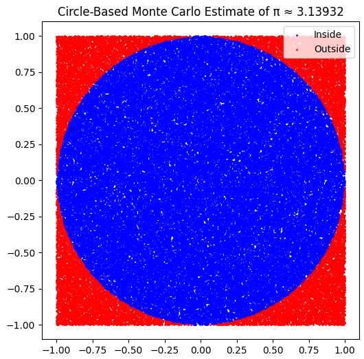

#  Advanced Statistical Simulations

---

##  Problem 1: Exploring the Central Limit Theorem (CLT) Through Simulations

###  Overview and Historical Context

The **Central Limit Theorem** (CLT) is a fundamental result in probability theory that emerged in the 18th century with early insights from Abraham de Moivre, and was formalized by Pierre-Simon Laplace and later by Lyapunov. It underpins the reliability of the **normal distribution** in inferential statistics.

The theorem states:

> Given a population with finite mean $\mu$ and finite standard deviation $\sigma$, the sampling distribution of the sample mean $\bar{X}$ of size $n$ tends toward a normal distribution as $n$ becomes large, regardless of the population’s original distribution.

$$
\bar{X} \sim \mathcal{N}\left(\mu, \frac{\sigma^2}{n}\right)
$$

---

###  Experimental Setup

We simulate three population types:

- Uniform distribution $\mathcal{U}(0,1)$
- Exponential distribution $\text{Exp}(\lambda = 1)$
- Binomial distribution $\text{Bin}(n=10, p=0.5)$

We generate:
- A large population ($N = 100,000$ values)
- Sampling distributions for sample sizes $n = \{5, 10, 30, 50\}$

---

---

###  Real-World Implications

- **Survey analysis**: Estimating population opinions with confidence intervals.
- **Industrial quality control**: Using sample means to monitor process stability.
- **Machine Learning**: Underpins assumptions in regression and hypothesis testing.

---

##  Problem 2: Estimating $\pi$ Using Monte Carlo Methods

---

###  Monte Carlo Methods: Background

Monte Carlo methods originated with **Stanislaw Ulam and John von Neumann** during nuclear simulations in the 1940s. They rely on **random sampling** to numerically approximate mathematical constants, integrals, and probabilities.

---

## Part A: Unit Circle in a Square

###  Theory

Using geometry:
- Area of unit circle: $A_{\text{circle}} = \pi r^2 = \pi$
- Area of square enclosing it: $A_{\text{square}} = (2r)^2 = 4$

Thus,
$$
\pi \approx 4 \cdot \frac{\text{Points inside circle}}{\text{Total points}}
$$

---

---

## Part B: Buffon’s Needle

###  Theory

Drop a needle of length $l$ on parallel lines spaced $d$ apart. The probability of crossing a line is:
$$
P = \frac{2l}{\pi d}
$$

So:
$$
\pi \approx \frac{2lN}{dC}
$$
where $C$ is the number of crossings among $N$ trials.

---

##  Final Thoughts

- **CLT** ensures the robustness of sampling in statistics, explaining the central role of the normal distribution.
- **Monte Carlo methods** demonstrate how randomness can converge on precise mathematical truths.
- These tools are foundational across data science, finance, physics, and AI.

---

##  References

- Ross, S. (2014). *Introduction to Probability and Statistics for Engineers and Scientists*.
- Grimmett & Stirzaker. (2001). *Probability and Random Processes*.
- Wikipedia: Central Limit Theorem, Buffon’s Needle, Monte Carlo Method.

---

