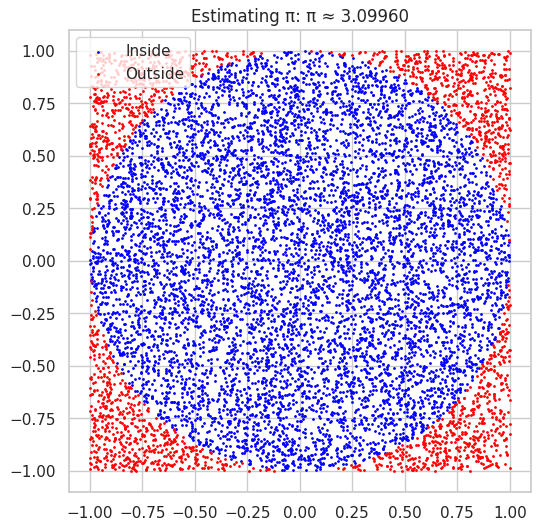

##  Problem 2: Estimating $\pi$ Using Monte Carlo Methods

###  Motivation

Monte Carlo methods use random sampling to compute numerical estimates. A well-known application is the estimation of $\pi$ via two different approaches:

1. **Geometric Method (Circle inside Square)**
2. **Buffon's Needle Experiment**

---

###  Part I: Circle Method

#### Theoretical Idea

- Inscribe a unit circle in a 2x2 square.
- Generate random points $(x, y) \in [-1, 1] \times [-1, 1]$.
- Count how many lie within the unit circle ($x^2 + y^2 \leq 1$).

Approximate:

$$
\pi \approx 4 \cdot \frac{\text{Number inside circle}}{\text{Total points}}
$$


---

###  Part II: Buffon’s Needle

#### Theoretical Idea

Let $L$ be needle length and $d$ be line spacing ($L \leq d$). Then:

$$
\pi \approx \frac{2 L N}{d C}
$$

Where:
- $N$ = total drops
- $C$ = number of crossings

```python
def estimate_pi_buffon(num_throws=10000, L=1.0, d=2.0):
    theta = np.random.uniform(0, np.pi, num_throws)
    y = np.random.uniform(0, d/2, num_throws)
    crosses = y <= (L/2) * np.sin(theta)
    C = np.sum(crosses)
    if C == 0: return None
    return (2 * L * num_throws) / (d * C)

print(f'Estimating π using Buffon’s Needle: π ≈ {estimate_pi_buffon():.5f}')
```

---

###  Comparison of Methods

| Method             | Strengths                      | Weaknesses                      |
|--------------------|-------------------------------|----------------------------------|
| Circle Monte Carlo | Visually intuitive, simple    | Converges slowly                 |
| Buffon’s Needle    | Historical, geometric insight | Requires understanding of angles |

---

##  Final Reflections

- CLT simulations demonstrate robustness across population types and sizes.
- Monte Carlo techniques for $\pi$ reinforce key statistical concepts.
- These methods highlight how randomness, repetition, and statistical laws combine to yield predictable outcomes.
